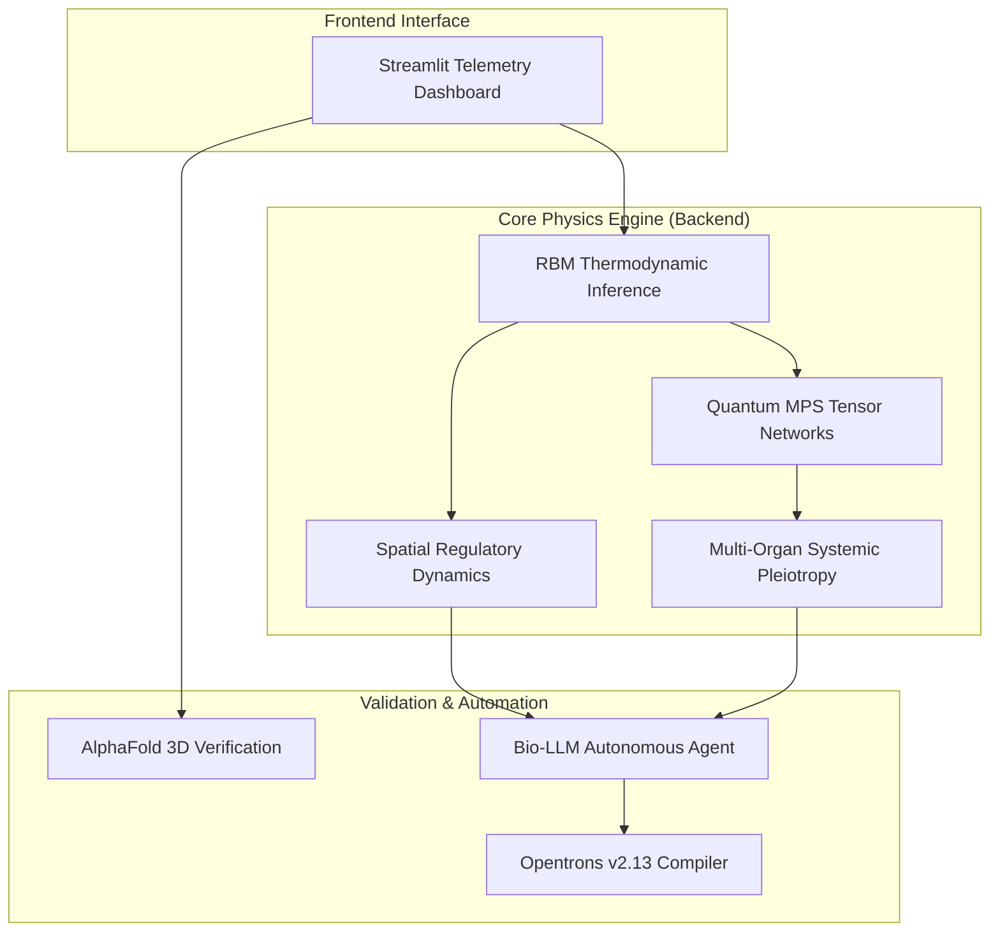

# 🧬 MOSAIC v1.0
**Multi-Omic Single-cell Attractor Circuit Inference**
*A closed-loop biological operating system engineered by PixelForge Studio.*

[Live Telemetry Sandbox (Hugging Face)](https://huggingface.co/spaces/BalajiM020504/mosaic-circuit-inference) • [Architecture Documentation](#-system-architecture) • [Robotic Deployment](#-wet-lab-robotic-execution-phase-10)

<div align="center">


</div>

## 🌌 Platform Abstract
The current paradigm of single-cell analysis treats cells as isolated data points within static clusters. In reality—such as within an evolving solid tumor—a cell is a dynamic physical engine, continuously warped by the thermodynamic fields and signaling gradients of its neighbors.

MOSAIC bridges statistical biophysics, deep generative AI, and liquid-handling hardware automation into a unified pipeline. It abandons legacy clustering, mapping single-cell gene regulatory networks directly into continuous thermodynamic fields using custom Quantum-Inspired Mean-Field Restricted Boltzmann Machines (RBMs). This allows us to not only reverse-engineer cell fate but to automate its physical, wet-lab execution.

## 🏗️ Architecture Overview



## 🚀 Core Engine Capabilities

1. **Quantum-Inspired Systemic Pleiotropy (Phases 8 & 9)**
Scales target discovery from single cells to whole-body networks. Using low-rank Matrix Product State (MPS) tensor networks via `opt_einsum`, the backend computes real-time collateral toxicity across Target, Cardiac, Neural, and Hepatic tissues. It utilizes stable, deterministic sinusoidal baselines to represent unique homeostatic basins, preventing memory bottlenecks during massive system state contractions.

2. **Spatial Regulatory Dynamics (Phase 5)**
Upgrades standard RBMs with a Mean-Field Approximation to compute an $\mathcal{O}(N^2)$ physical distance matrix via a Gaussian RBF kernel. Simulate and animate how a sparse gene intervention applied to a single cell creates an energetic paracrine shockwave, pulling neighboring cells out of their stable attractors.

3. **Dynamic AlphaFold & UniProt Verification (Phase 7)**
Moving from statistical mechanics to physical reality. The pipeline dynamically queries the public UniProt REST API to resolve standard human gene symbols to primary accession IDs, streaming interactive, rotatable 3D atomic structures directly from the DeepMind AlphaFold Database via `py3Dmol`.

4. **Autonomous Pre-Clinical Documentation (Phase 6)**
Built-in regulatory intelligence. MOSAIC routes calculated thermodynamic energy landscapes, perturbation dosages, and systemic toxicity metrics straight to an integrated Bio-LLM agent. The agent autonomously authors structured, exportable FDA-style pre-clinical pharmacodynamics dossiers.

5. **Closed-Loop Robotic Execution (Phase 10)**
Closing the final physical gap. Once the Adam-driven inverse design optimizer isolates a sparse target vector, MOSAIC automatically generates and exports an executable Opentrons API v2.13 Python protocol, ready for immediate physical 96-well plate fluid handling on an OT-2 liquid robot.

## 📊 Visual Telemetry
*(Note: Replace the placeholder image URLs below with your actual project screenshots and GIFs once uploaded to your repository)*

| Thermodynamic Landscape | Systemic Toxicity Radar |
| :---: | :---: |
| Continuous energy topography modeled via RBM inference. Deep wells represent stable cellular attractors. | Collateral multi-organ toxicity mapped via quantum tensor emulation. |

| Structural Validation (AlphaFold) | Wet-Lab Execution (OT-2) |
| :---: | :---: |
| Real-time DeepMind DB resolution of targeted transcription factors directly in the dashboard. | Dynamically compiled OpenTrons protocol for physical 96-well plate dispensing. |

## 🧮 Mathematical Foundation
MOSAIC models the probability of a cellular state vector $\mathbf{v}$ using a Restricted Boltzmann Machine framework, where the free energy $F(\mathbf{v})$ is defined as:

$$F(\mathbf{v}) = - \mathbf{a}^T \mathbf{v} - \sum_{j} \log \left( 1 + \exp \left( b_j + \mathbf{W}_j^T \mathbf{v} \right) \right)$$

To calculate Spatial Regulatory Dynamics across a simulated tissue microenvironment, the environmental energy coupling $\Delta E_{env}$ is defined using a Gaussian Radial Basis Function (RBF) to represent paracrine signaling decay over distance:

$$\Delta E_{env}^{i} = \lambda \sum_{j \neq i} K(\mathbf{x}_i, \mathbf{x}_j) \left( \mathbf{v}_i \cdot \mathbf{v}_j \right) \quad \text{where} \quad K(\mathbf{x}_i, \mathbf{x}_j) = \exp\left(-\frac{\|\mathbf{x}_i - \mathbf{x}_j\|^2}{2\sigma^2}\right)$$

## 🛠️ Installation & Setup
To run the MOSAIC operating system locally, ensure you have Python 3.10+ installed.

1. **Clone the Repository**:
```bash
git clone https://github.com/balajiprincejoshva-byte/mosaic-circuit-inference.git
cd mosaic-circuit-inference
```
2. **Create a Virtual Environment & Install Dependencies**:
```bash
python -m venv venv
source venv/bin/activate  # On Windows: venv\Scripts\activate
pip install --no-cache-dir -r requirements.txt
```
3. **Configure Environment Variables**:
MOSAIC requires an OpenRouter API key for the Phase 6 AI Dossier generation to run natively.
```bash
export OPENROUTER_API_KEY="sk-or-v1-your-key-here"
```
4. **Launch the Telemetry Dashboard**:
```bash
streamlit run app/streamlit_app.py
```

## 📁 System Architecture
The repository is modularized into a decoupled frontend interface and a high-performance backend physics engine:
```text
mosaic-circuit-inference/
├── app/
│   └── streamlit_app.py       # Main UI loop, glassmorphic layout, UI telemetry, loader injection
├── core/
│   ├── rbm_thermo.py          # Standard Dense RBM physics engine
│   ├── quantum_rbm.py         # Phase 9: Matrix Product State tensor compression
│   ├── spatial.py             # Phase 5: RBF distance matrices & paracrine shockwaves
│   ├── systemic.py            # Phase 8: Multi-organ (Cardiac, Neural, Hepatic) baseline networks
│   ├── structural.py          # Phase 7: UniProt REST & AlphaFold EBI bridges
│   ├── bio_agent.py           # Phase 6: Autonomous FDA-style dossier generation
│   └── robotics.py            # Phase 10: Opentrons protocol compiler
├── tests/
│   └── test_physics.py        # Systemic & Tensor mathematics validation
├── Dockerfile                 # Containerization for Hugging Face Spaces deployment
├── requirements.txt           # Strict dependency locks (torch, opentrons, opt_einsum)
└── README.md
```

## 🔬 Wet-Lab Robotic Execution (Phase 10)
MOSAIC isn't just a simulation. By clicking "Deploy to Physical Wet-Lab" within the Autonomous Discovery tab, the platform converts its mathematically derived multi-gene perturbation vectors into physical volume measurements.

It automatically generates a `mosaic_ot2_protocol.py` script adhering to the Opentrons API v2.13 schema. This script manages hardware initialization, 96-well flat plate staging, and automated pipette transfers (`p300_single_gen2`) to execute the intervention flawlessly in a physical laboratory environment.

## 📜 License
Distributed under the MIT License. See `LICENSE` for more information.
